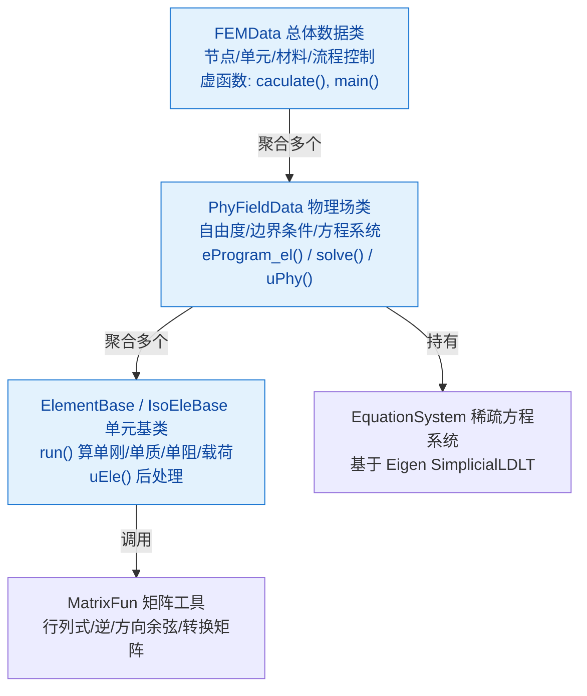
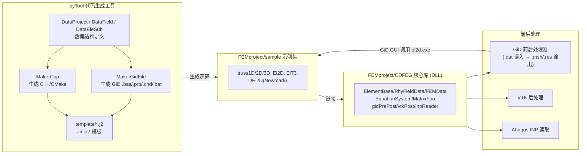
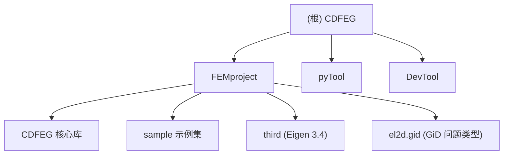

# CDFEG 项目 AI 上下文（根级）

> 创刀有限元程序生成系统（CDFEG = Chuang-Dao Finite Element Program Generator）。
> 本文件由 init-architect 子智能体于 2026-06-18 15:43:22 生成/更新，供 AI 协作时快速建立全局认知。

## 一、项目愿景

CDFEG 是一套**自研的有限元程序基础库 + 代码生成工具链**，目标是：

1. 用 C++ 提供一套**面向对象、可复用**的有限元基础库（核心库 `CDFEG`），覆盖单元 → 物理场 → 总体数据的三层抽象，让有限元编程"像填空一样简单"。
2. 用 Python（Jinja2 模板）**根据数据结构自动生成**符合核心库约定的 C++ 有限元程序与 GiD 问题类型文件，避免手工重复编码。
3. 提供 6 个覆盖桁架/二维/三维/动力学的**示例程序**，作为核心库的用法示范与回归基线。

适用人群：有限元方法学习者、课程教学、研究原型搭建。许可证：GPL-3.0。

## 二、架构总览

### 2.1 三层架构（核心库内部）

核心库 `FEMproject/CDFEG/` 采用严格的面向对象三层架构。下层包含上层，依赖自上而下注入：



### 2.2 系统组成与前后处理链路



### 2.3 数据流（典型静力求解）

```
GiD .dat ──GidPrePost.pre()──> FEMData(节点/单元/材料/边界条件)
   └── FEMData.caculate()
         ├── PhyFieldData.initMatrix()      # 编号 + 稀疏骨架
         ├── PhyFieldData.eProgram_el()     # 遍历单元 run()，组装总刚
         ├── EquationSystem.applyFirstBCs() # 划行列法施加一类边界
         ├── EquationSystem.solve()         # Eigen SimplicialLDLT
         └── PhyFieldData.uPhy()            # 节点/单元结果
GiD .res <──GidPrePost.post2()── 读 PhyFieldData._nodeRes / _elemRes
```

## 三、模块结构图



## 四、模块索引

| 模块 | 路径 | 一句话职责 | 文档 |
| --- | --- | --- | --- |
| 核心库（DLL） | `FEMproject/CDFEG/` | 有限元三层架构基础库 + GiD/VTK/INP 前后处理 | [CLAUDE.md](./FEMproject/CDFEG/CLAUDE.md) |
| 示例集 | `FEMproject/sample/` | 6 个示例：truss1D/2D/3D、El2D、ElT3、DEl2D | [CLAUDE.md](./FEMproject/sample/CLAUDE.md) |
| 代码生成工具 | `pyTool/` | Jinja2 模板驱动的 C++/CMake/GiD 文件生成器 | [CLAUDE.md](./pyTool/CLAUDE.md) |
| 开发工具 | `DevTool/` | `add_license_header.py` 批量加 GPL 头 | （单文件，无独立文档） |
| 第三方 | `FEMproject/third/Eigen/` | Eigen 3.4.0 线性代数库（header-only） | （第三方，不写文档） |

## 五、构建与使用方式

### 5.1 构建 FEMproject（CMake + MinGW 或 MSVC）

仓库根 `FEMproject/build.bat` 当前内容为通用 CMake 流程：

```bat
set BUILD_DIR=build
set CONFIG=Release
cmake -B %BUILD_DIR% -DCMAKE_BUILD_TYPE=%CONFIG%
```

> 注：`build.bat` 未指定生成器（`-G "MinGW Makefiles"`），且未执行 `cmake --build`。完整构建需手动追加构建命令或按项目摘要使用 MinGW Makefiles 生成器。

根 `FEMproject/CMakeLists.txt` 通过 `add_subdirectory` 聚合：核心库 + 6 个示例（truss1D/2D/3D、El2D、ElT3、DEl2D）。

关键 CMake 设置（来自 `FEMproject/CDFEG/CMakeLists.txt`）：
- C++14
- `CMAKE_WINDOWS_EXPORT_ALL_SYMBOLS=TRUE`（Windows DLL 自动导出）
- 编译宏 `CDFEG_EXPORTS`（配合 `CDFEG.h` 的 `CDFEG_API` 宏）
- MSVC 下 `/utf-8`（避免 UTF-8 中文注释被按 GBK 解码导致乱码错误）

### 5.2 使用代码生成器（pyTool）

```python
from DataProject import DataProject
from DataField import DataField
from DataEleSubG import DataEleSubG
from MakerCpp import MakerCpp
from MakerGidFile import MakerGidFile

project = DataProject("el2d", 2)
field = DataField("ElDisp")
ele = DataEleSubG("ElQ4g", 4)
ele.type = 2; ele.dispNames = ["u","v"]; ele.paramNames = [...]
ele.gaussPoints = [...]; ele.gaussWeights = [...]; ele.shapeFuns = [...]
field.addEleSub(ele)
project.addField(field)

# mode='new' 创建独立解决方案；mode='add' 追加到现有 FEMproject
maker = MakerCpp(project, "sample/El2D", mode='add',
                 sln_cmake_path="CMakeLists.txt")
maker.makeAll()                       # 生成 C++ 源码 + CMake
MakerGidFile(project, "sample/El2D").makeAll()  # 生成 GiD 文件
```

`MakerCpp` 两种模式：`mode='new'`（复制 CDFEG 库 + third，生成解决方案级 CMake）与 `mode='add'`（只生成项目文件，向现有 CMake 追加 `add_subdirectory`）。

### 5.3 运行示例

每个示例编译后生成可执行文件，两种入口形式：
- **makeData 形式**（mainMode=0，如 truss1D）：在 `main.cpp` 中手工 `addNode/addEle`，无文件依赖。
- **GiD 数据文件形式**（mainMode=1，如 El2D）：命令行 `<project> <path>`，由 `GidPrePost.pre()` 读取 `<project>.dat`。

## 六、关键约定

### 6.1 命名空间与导出

- 核心库统一命名空间 `CDFEG::`（曾用名 `SIFEG::`）。
- DLL 导出宏 `CDFEG_API`：编译库时定义 `CDFEG_EXPORTS` 走 `dllexport`，使用方走 `dllimport`。

### 6.2 单元子程序契约（ElementBase）

派生单元必须：
1. 构造函数设置 `_name`、`_nNode`、`_dispNames`、`_paramNames`、`_vtkCellType` 等基本信息；
2. 重写 `run(r, coef, matParams)` 返回 `EleSubResult{estif, emass, edamp, eload, nodeIds}`；
3. 可选重写 `uEle(...)` 返回后处理结果（应力、轴力等）。

### 6.3 物理场契约（PhyFieldData）

- 静力椭圆问题：默认 `eProgram()` 转发到已实现的 `eProgram_el()`，**无需重写**。
- 动力学/非椭圆：**必须重写** `eProgram()`（如 Newmark 有效矩阵装配）与 `uPhy()`（状态更新 + 历史保存）。
- 详见 `FEMproject/CDFEG/CLAUDE.md` 与 `FEMproject/sample/DEl2D/升级说明.md`（记录了 5 个易错点，尤其 `_bSavedData0` 缓存基线陷阱）。

### 6.4 数据类契约（FEMData）

派生总体数据类必须：
1. 构造函数设置网格（或通过 `GidPrePost.pre()` 从 `.dat` 读取）；
2. 重写 `caculate()` 控制整个计算流程；
3. 重写 `main()`（部分示例直接在 `main.cpp` 用全局函数替代）。

### 6.5 前后处理器（Processor 派生）

- `Processor` 为抽象基类（`pre()` / `post()`）。
- `GidPrePost`：读 `.dat`、写 `.msh`/`.res`，支持 `post2()` 多结果项输出。
- `vtkPost`：写 VTK 文件。
- `inpReader`：读 Abaqus `.inp`。

### 6.6 dat 材料名约定

`GidPrePost::readMate` 按 `mat_<单元_name>` 匹配材料。dat 文件 elem 段的 `name` 必须与单元 `_name` 完全一致，否则材料读取失败、单刚全为 0。

## 七、AI 使用指引

1. **改核心库前**：先看 `FEMproject/CDFEG/CLAUDE.md` 的三层架构契约，避免破坏派生类假设。
2. **改示例前**：先确认该示例是手写还是 pyTool 生成——**运行 pyTool 的 test 脚本会覆盖手写 C++ 源码**（见 `sample/DEl2D/升级说明.md` 5.11 节）。
3. **改生成器前**：先看 `pyTool/CLAUDE.md` 的数据结构（DataProject→DataField→DataEleSub）与模板（`pyTool/template/*.j2`）映射。
4. **结构性问题**：优先用 codegraph（已索引 622 文件、24607 节点、33238 边）。
5. **文件忽略**：遵循 `.gitignore`，跳过 `build/`、`__pycache__/`、`.codegraph/`、二进制（`.dll/.exe`）与 Eigen 第三方源码。
